# Lead Scoring using Machine Learning

In this assignment, we explore lead scoring on F)reedom Financial Network (FFN) sales data. We explore a few variables to understand their relationship with the outcome (lead scored or not). We build a Logistic Regression model to predict the probability of scoring a lead. We explore with oversampling using SMOTE to reduce the class imbalance and other classifiers like Naive Bayes to get a holistic idea of various approaches and then select the best ones.  

Finally, we build a lead ranking technique to rank the leads. We assign weights to every feature based on the impact on the funded column, and use that to build the ranking list.

The answers to the questions in the document are towards the end of the document.


```python
import pandas as pd
import numpy as np
import matplotlib.pyplot as plt
import seaborn as sns
from sklearn.model_selection import train_test_split
from sklearn.linear_model import LogisticRegression
from sklearn.metrics import classification_report, confusion_matrix, roc_auc_score, r2_score
from sklearn.ensemble import RandomForestClassifier, RandomForestRegressor
from sklearn.tree import DecisionTreeClassifier
from sklearn.svm import SVC
from imblearn.over_sampling import SMOTE
from tqdm import tqdm
import torch
import torch.nn as nn
import torch.nn.functional as F
from sklearn.naive_bayes import GaussianNB

```


```python
dataframe = pd.read_csv("lead_scoring_homework.csv")
```


```python
dataframe['lead_age'] = pd.to_datetime(dataframe['assignment_datetime']) - pd.to_datetime(dataframe['created_datetime'])
dataframe['lead_age'] = dataframe['lead_age'].apply(lambda x : x.days)
dataframe['lead_source'] = dataframe['lead_source'].astype('str')
```


```python
dataframe.head()
```


<div>
<style scoped>
    .dataframe tbody tr th:only-of-type {
        vertical-align: middle;
    }

    .dataframe tbody tr th {
        vertical-align: top;
    }

    .dataframe thead th {
        text-align: right;
    }
</style>
<table border="1" class="dataframe">
  <thead>
    <tr style="text-align: right;">
      <th></th>
      <th>lead_id</th>
      <th>funded</th>
      <th>created_datetime</th>
      <th>assignment_datetime</th>
      <th>loan_to_income</th>
      <th>co_app_income</th>
      <th>job_status</th>
      <th>fico_score</th>
      <th>loan_amount</th>
      <th>loan_use</th>
      <th>ndi_ratio</th>
      <th>lead_source</th>
      <th>open_accounts</th>
      <th>clicked_offer</th>
      <th>lead_age</th>
    </tr>
  </thead>
  <tbody>
    <tr>
      <th>0</th>
      <td>7599355</td>
      <td>0</td>
      <td>2021-09-11 17:42:44+00:00</td>
      <td>2021-09-11 17:48:47+00:00</td>
      <td>24.621212</td>
      <td>0.0</td>
      <td>Part-Time</td>
      <td>668</td>
      <td>32500</td>
      <td>Debt Consolidation</td>
      <td>0.232132</td>
      <td>0</td>
      <td>8</td>
      <td>0</td>
      <td>0</td>
    </tr>
    <tr>
      <th>1</th>
      <td>7600116</td>
      <td>0</td>
      <td>2021-09-11 21:57:35+00:00</td>
      <td>2021-09-12 07:59:24+00:00</td>
      <td>20.000000</td>
      <td>0.0</td>
      <td>Not Employed</td>
      <td>792</td>
      <td>40000</td>
      <td>Other</td>
      <td>0.146557</td>
      <td>0</td>
      <td>6</td>
      <td>0</td>
      <td>0</td>
    </tr>
    <tr>
      <th>2</th>
      <td>7599525</td>
      <td>0</td>
      <td>2021-09-11 18:29:20+00:00</td>
      <td>2021-09-12 07:32:12+00:00</td>
      <td>27.272727</td>
      <td>0.0</td>
      <td>Full-Time</td>
      <td>755</td>
      <td>30000</td>
      <td>Home Improvement</td>
      <td>0.510868</td>
      <td>0</td>
      <td>5</td>
      <td>0</td>
      <td>0</td>
    </tr>
    <tr>
      <th>3</th>
      <td>7599699</td>
      <td>0</td>
      <td>2021-09-11 19:24:46+00:00</td>
      <td>2021-09-12 08:44:09+00:00</td>
      <td>34.965035</td>
      <td>0.0</td>
      <td>Full-Time</td>
      <td>677</td>
      <td>20000</td>
      <td>Debt Consolidation</td>
      <td>0.457189</td>
      <td>0</td>
      <td>7</td>
      <td>0</td>
      <td>0</td>
    </tr>
    <tr>
      <th>4</th>
      <td>7599570</td>
      <td>0</td>
      <td>2021-09-11 18:40:24+00:00</td>
      <td>2021-09-12 15:42:48+00:00</td>
      <td>18.666667</td>
      <td>0.0</td>
      <td>Self-Employed</td>
      <td>691</td>
      <td>14000</td>
      <td>Other</td>
      <td>0.470130</td>
      <td>0</td>
      <td>3</td>
      <td>0</td>
      <td>0</td>
    </tr>
  </tbody>
</table>
</div>


### The following cell shows that there is a heavy class imbalance, which could potentially affect the performance of our prediction model.


```python
sns.countplot(data = dataframe, x = 'funded')
```


    <AxesSubplot:xlabel='funded', ylabel='count'>


    
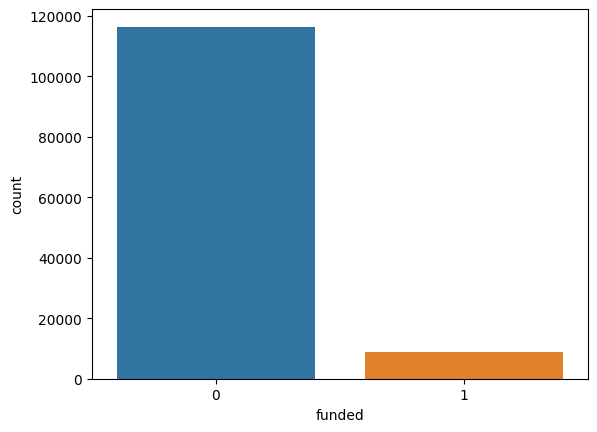
    


### The following cell shows that people with full time roles constitute the majority of applicants for getting a loan. And they are the ones who have been funded the most


```python
sns.countplot(data = dataframe, x = 'job_status', hue='funded')
```


    <AxesSubplot:xlabel='job_status', ylabel='count'>


    
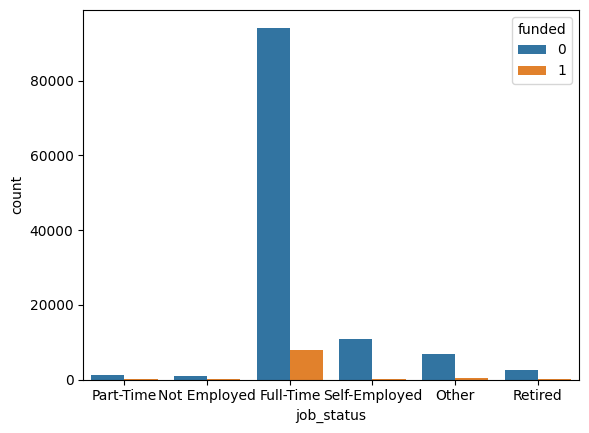
    


### The following slide shows that most loan applications are for debt consolidation, followed by credit card refinancing. These are originally the products which FFN focussed on


```python
plt.figure(figsize = (10, 5))
sns.countplot(data = dataframe, x = 'loan_use', hue='funded')
plt.xticks(rotation = 90)
plt.show()
```


    
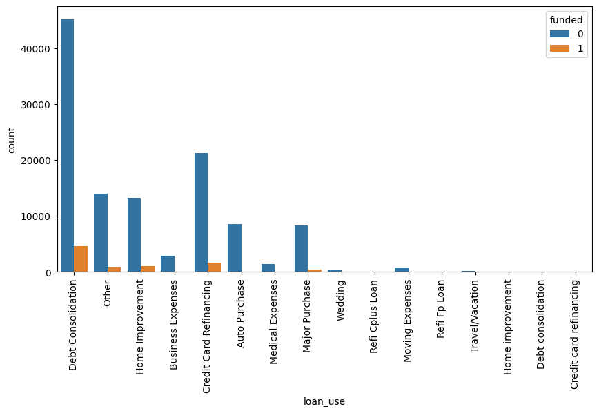
    


### The following variable shows that people who clicked on the ad were more likely to be funded than those who did not. This means that FFN should focus on targetted ads, and they are more likely to be funded.


```python
plt.figure(figsize = (10, 5))
sns.countplot(data = dataframe, x = 'clicked_offer', hue='funded')
plt.xticks(rotation = 90)
plt.show()
```


    
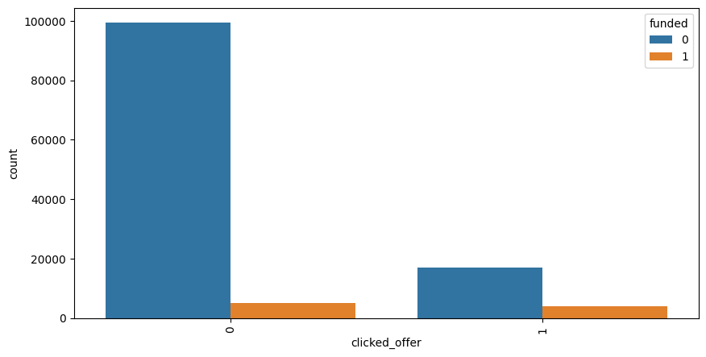
    


### Most of the leads are assigned to a salesperson within a day. In addition, they have the highest chance of being funded. 

### Here we see that leads with assignment time less than 1 day has the most chance of being funded. This means that any leads with age > 30 days should automatically be discarded, as it would be 


```python

plt.figure(figsize = (9, 15))
plt.subplot(3,1,1)
sns.countplot(data = dataframe[dataframe['lead_age']<=10], x = 'lead_age', hue='funded')
plt.xticks(rotation = 90)

plt.subplot(3,1,2)
sns.countplot(data = dataframe[dataframe['lead_age']>=10], x = 'lead_age', hue='funded')
plt.xticks(rotation = 90)

plt.subplot(3,1,3)
sns.countplot(data = dataframe[dataframe['funded']==1], x = 'lead_age', hue='funded')
plt.xticks(rotation = 90)
plt.show()
```


    
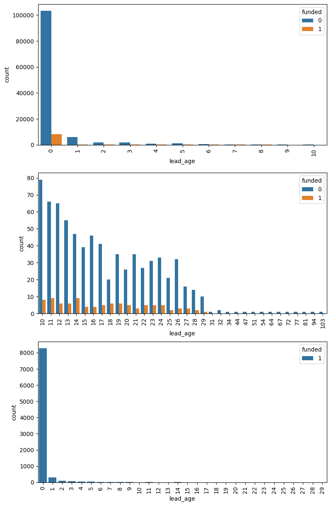
    


### The following shows the loan to income ratio with the funded variable. It is surprising that the amount of people funded first increases, then dips and again increases. However, we see a similar trend for not funded, and see that people with highest loan_to_income are most likely to be rejected. FFN should focus on leads having loan_to_income value between 10 and 20. 


```python

plt.figure(figsize = (10, 5))
plt.subplot(1,2,1)
sns.kdeplot(x='loan_to_income', data=dataframe[dataframe['funded']==1], hue='funded')

plt.subplot(1,2,2)
sns.kdeplot(x='loan_to_income', data=dataframe[dataframe['funded']==0], hue='funded')
plt.show()
```


    
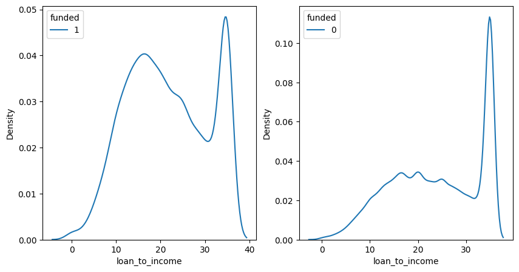
    


### The ndi ratio is almost normally distributed, where a ratio of 0.4 is most likely to be funded. 


```python

plt.figure(figsize = (10, 5))
plt.subplot(1,2,1)
sns.kdeplot(x='ndi_ratio', data=dataframe[dataframe['funded']==1], hue='funded')

plt.subplot(1,2,2)
sns.kdeplot(x='ndi_ratio', data=dataframe[dataframe['funded']==0], hue='funded')
plt.show()
```


    
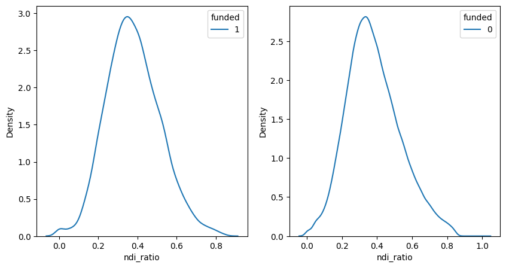
    


### Most of the loan applicants have a fico score > 600. This is again normally distributed, with a mean of around 700-750. However, the fico_score is not an indicator on the outcome, as seen by both the graphs. 


```python

plt.figure(figsize = (10, 5))
plt.subplot(1,2,1)
sns.kdeplot(x='fico_score', data=dataframe[dataframe['funded']==1], hue='funded')
plt.subplot(1,2,2)
sns.kdeplot(x='fico_score', data=dataframe[dataframe['funded']==0], hue='funded')
plt.show()
```


    
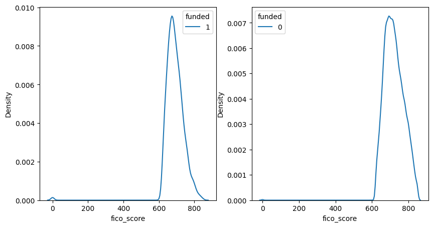
    


### The following graphs show that people with loans less than 20000 dollars are most likely to be funded. FFN should focus on leads where the loan amounts are less than 20000, as it would result in more funded loans than higher amounts. 


```python

plt.figure(figsize = (10, 5))
plt.subplot(1,2,1)
sns.kdeplot(x='loan_amount', data=dataframe[dataframe['funded']==1], hue='funded')
plt.subplot(1,2,2)
sns.kdeplot(x='loan_amount', data=dataframe[dataframe['funded']==0], hue='funded')
plt.show()
```


    
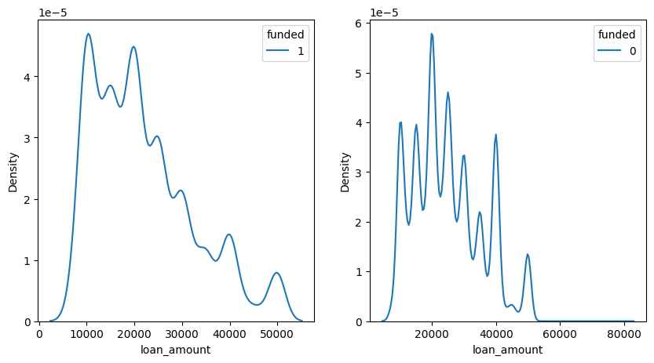
    


### The following few cells convert categorical columns (job_status, loan_use, lead_source) into one-hot-encoded columns and merge with the continuous valued columns


```python
dummies_df = pd.get_dummies(dataframe[dataframe.columns[dataframe.columns.isin(['job_status', 'loan_use', 'lead_source', ])]])
```


```python
print(dataframe.columns)
```

    Index(['lead_id', 'funded', 'created_datetime', 'assignment_datetime',
           'loan_to_income', 'co_app_income', 'job_status', 'fico_score',
           'loan_amount', 'loan_use', 'ndi_ratio', 'lead_source', 'open_accounts',
           'clicked_offer', 'lead_age'],
          dtype='object')
    


```python
new_df = pd.concat([dataframe[['funded',
       'loan_to_income', 'co_app_income', 'fico_score',
       'loan_amount', 'ndi_ratio','open_accounts',
       'clicked_offer', 'lead_age']], dummies_df], axis=1)
```

### The following heatmap shows the correlation of all continuous valued columns. We see that the loan-to-income is decently correlated with the loan_amount and ndi_ratio, which is logical. However, we will not drop either variables as they are important for our predictions. 


```python
plt.figure(figsize = (10,10))
sns.heatmap(dataframe.corr(), annot=True)
```


    <AxesSubplot:>


    
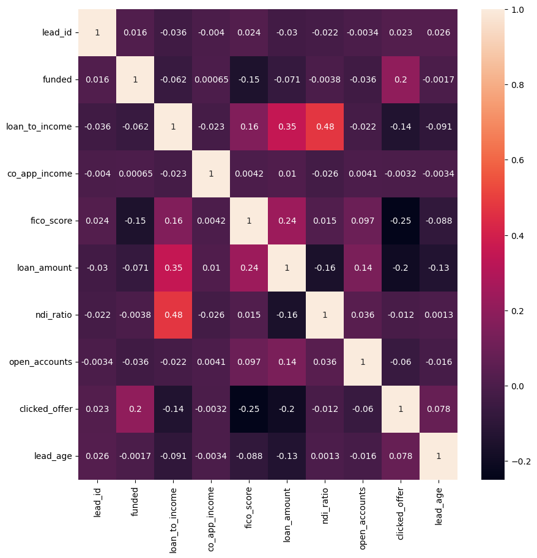
    


# Model training

### We consider that the assignment date is crucial to lead scoring because a lead will be assigned to a salesperson only if there is a chance that the lead will be scored. So we do not take lead age as a feature for building our model.

### However, we show the results when we include lead_age as a feature in our model. The predictions for the close rate improves drastically. 

## Model without lead Age


```python
X_train, X_test, y_train, y_test = train_test_split(new_df.drop(['funded', 'lead_age'], axis=1), new_df['funded'], test_size=0.4, stratify= new_df['funded'], random_state=42)
```


```python
y_train.value_counts()/len(y_train)
```


    0    0.928211
    1    0.071789
    Name: funded, dtype: float64


```python
y_test.value_counts()/len(y_test)
```


    0    0.928225
    1    0.071775
    Name: funded, dtype: float64


```python
from sklearn.preprocessing import StandardScaler
```


```python
standard_scaler = StandardScaler()
standard_scaler.fit(X_train)
```


    StandardScaler()


```python
X_train_sc = standard_scaler.transform(X_train)
X_test_sc = standard_scaler.transform(X_test)
```


```python
logistic_regression = LogisticRegression(class_weight = "balanced", max_iter=1000, solver="liblinear", random_state=42, penalty="l2")
#logistic_regression = GaussianNB()

logistic_regression.fit(X_train_sc, y_train)
```


    LogisticRegression(class_weight='balanced', max_iter=1000, random_state=42,
                       solver='liblinear')


```python
print(classification_report(y_train, logistic_regression.predict(X_train_sc)))
```

                  precision    recall  f1-score   support
    
               0       0.97      0.74      0.84     69795
               1       0.16      0.66      0.26      5398
    
        accuracy                           0.74     75193
       macro avg       0.57      0.70      0.55     75193
    weighted avg       0.91      0.74      0.80     75193
    
    


```python
print(classification_report(y_test, logistic_regression.predict(X_test_sc)))
```

                  precision    recall  f1-score   support
    
               0       0.96      0.74      0.84     46531
               1       0.16      0.65      0.26      3598
    
        accuracy                           0.73     50129
       macro avg       0.56      0.69      0.55     50129
    weighted avg       0.91      0.73      0.80     50129
    
    


```python
roc_auc_score(y_test, logistic_regression.predict(X_test_sc))
```


    0.6936563022668373


```python
new_df['predictions'] = logistic_regression.predict_proba(standard_scaler.transform(new_df.drop(['funded', 'lead_age'], axis=1)))[:,1]
plt.plot(new_df.sort_values(by=['lead_age']).groupby(by=['lead_age']).mean()['predictions'])
plt.xlabel("Lead Age")
plt.ylabel("Predicted close rate")
```


    Text(0, 0.5, 'Predicted close rate')


    
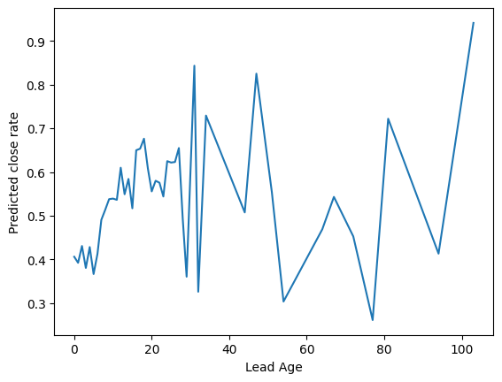
    


## Model with lead Age


```python
X_train, X_test, y_train, y_test = train_test_split(new_df.drop(['funded'], axis=1), new_df['funded'], test_size=0.4, stratify= new_df['funded'], random_state=42)
```


```python
y_train.value_counts()/len(y_train)
```


    0    0.928211
    1    0.071789
    Name: funded, dtype: float64


```python
y_test.value_counts()/len(y_test)
```


    0    0.928225
    1    0.071775
    Name: funded, dtype: float64


```python
from sklearn.preprocessing import StandardScaler
```


```python
standard_scaler = StandardScaler()
standard_scaler.fit(X_train)
```


    StandardScaler()


```python
X_train_sc = standard_scaler.transform(X_train)
X_test_sc = standard_scaler.transform(X_test)
```


```python
logistic_regression = LogisticRegression(class_weight = "balanced", max_iter=1000, solver="liblinear", random_state=42, penalty="l2")
#logistic_regression = GaussianNB()

logistic_regression.fit(X_train_sc, y_train)
```


    LogisticRegression(class_weight='balanced', max_iter=1000, random_state=42,
                       solver='liblinear')


```python
print(classification_report(y_train, logistic_regression.predict(X_train_sc)))
```

                  precision    recall  f1-score   support
    
               0       0.97      0.74      0.84     69795
               1       0.17      0.66      0.26      5398
    
        accuracy                           0.74     75193
       macro avg       0.57      0.70      0.55     75193
    weighted avg       0.91      0.74      0.80     75193
    
    


```python
print(classification_report(y_test, logistic_regression.predict(X_test_sc)))
```

                  precision    recall  f1-score   support
    
               0       0.96      0.74      0.84     46531
               1       0.16      0.64      0.26      3598
    
        accuracy                           0.74     50129
       macro avg       0.56      0.69      0.55     50129
    weighted avg       0.91      0.74      0.80     50129
    
    


```python
roc_auc_score(y_test, logistic_regression.predict(X_test_sc))
```


    0.6922924867495855


```python
new_df['predictions'] = logistic_regression.predict_proba(standard_scaler.transform(new_df.drop(['funded'], axis=1)))[:,1]
plt.plot(new_df.sort_values(by=['lead_age']).groupby(by=['lead_age']).mean()['predictions'])
plt.xlabel("Lead Age")
plt.ylabel("Predicted close rate")
```


    Text(0, 0.5, 'Predicted close rate')


    
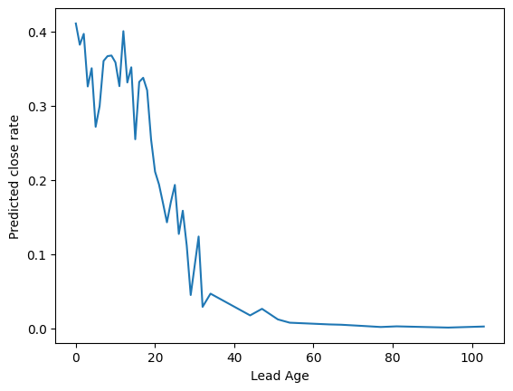
    


### Based on above graphs for predicted close rate as a function of lead age, we see that the predicted close rate does in fact decrease with age when using lead age as a variable. However, when we do not include it, the predictions for higher lead age increase. This is due to influence of other variables on the model. Although, there are very few instances where the lead age is > 30. The graph is not an indicator of the model performance because the average lead score will be lower for lower lead ages because there are more negative instances present than positive instances 

### However, I am still not convinced if we should use lead age as a variable in the model because we do not know  when a lead is assigned to a salesperson in real time and we could use this model as a factor in determining whether a lead should be assigned to a salesperson or not

## Gaussian NB and LogisticReg Model without lead Age and oversampling


```python
X_train, X_test, y_train, y_test = train_test_split(new_df.drop(['funded', 'lead_age'], axis=1), new_df['funded'], test_size=0.4, stratify= new_df['funded'], random_state=42)
```


```python
smote = SMOTE()
X_train_resampled, y_train_resampled = smote.fit_resample(X_train, y_train, )
```


```python
y_train_resampled.value_counts()/len(y_train_resampled)
```


    0    0.5
    1    0.5
    Name: funded, dtype: float64


```python
y_test.value_counts()/len(y_test)
```


    0    0.928225
    1    0.071775
    Name: funded, dtype: float64


```python
from sklearn.preprocessing import StandardScaler
```


```python
standard_scaler = StandardScaler()
standard_scaler.fit(X_train_resampled)
```


    StandardScaler()


```python
X_train_resampled_sc = standard_scaler.transform(X_train_resampled)
X_test_sc = standard_scaler.transform(X_test)
```


```python
logistic_regression= LogisticRegression(max_iter=1000, solver="liblinear", random_state=42, penalty="l2")
naive_bayes = GaussianNB()

logistic_regression.fit(X_train_resampled_sc, y_train_resampled)
naive_bayes.fit(X_train_resampled_sc, y_train_resampled)

```


    GaussianNB()


```python
print(classification_report(y_train_resampled, logistic_regression.predict(X_train_resampled_sc)))
```

                  precision    recall  f1-score   support
    
               0       0.99      0.17      0.29     69795
               1       0.54      1.00      0.70     69795
    
        accuracy                           0.58    139590
       macro avg       0.77      0.58      0.49    139590
    weighted avg       0.77      0.58      0.49    139590
    
    


```python
print(classification_report(y_test, logistic_regression.predict(X_test_sc)))
```

                  precision    recall  f1-score   support
    
               0       0.98      0.17      0.28     46531
               1       0.08      0.96      0.15      3598
    
        accuracy                           0.22     50129
       macro avg       0.53      0.57      0.22     50129
    weighted avg       0.92      0.22      0.27     50129
    
    


```python
print(classification_report(y_train_resampled, naive_bayes.predict(X_train_resampled_sc)))
```

                  precision    recall  f1-score   support
    
               0       0.95      0.27      0.42     69795
               1       0.57      0.98      0.72     69795
    
        accuracy                           0.63    139590
       macro avg       0.76      0.63      0.57    139590
    weighted avg       0.76      0.63      0.57    139590
    
    


```python
print(classification_report(y_test, naive_bayes.predict(X_test_sc)))
```

                  precision    recall  f1-score   support
    
               0       0.95      0.27      0.42     46531
               1       0.08      0.83      0.15      3598
    
        accuracy                           0.31     50129
       macro avg       0.52      0.55      0.28     50129
    weighted avg       0.89      0.31      0.40     50129
    
    


```python
roc_auc_score(y_test, logistic_regression.predict(X_test_sc))
```


    0.5655746677228779


```python
roc_auc_score(y_test, naive_bayes.predict(X_test_sc))
```


    0.5500775816116612


### We see that oversampling is detrimental to the performance of both the models. We might need a smarter way of oversampling where there is a better judgement of the population of leads getting funded. 

### Thus, the final model we use is logistic regression model without lead age. 

# Lead Ranking

### Here, we try to improve upon the greedy ranking of leads. We use every feature in our scoring technique. For the categorical columns, we use the ratio of that column being present and the outcome being funded to the total values in the column. This gives us a weight which we will multiply with the binary value of that column being present or not.


```python
df_scoring = new_df.drop(['lead_age'], axis=1)
```


```python
categorical_columns = df_scoring.columns[7:-1]
continuous_columns = df_scoring.columns[1:7]
```


```python
weights_categorical = {}
for col in categorical_columns:
    try:
        value_counts_funded = df_scoring[df_scoring['funded']==1][col].sum()/len(df_scoring[df_scoring['funded']==1][col])
        weights_categorical[col] = value_counts_funded
    except:
        weights_categorical[col] = 0
```


```python
weights_categorical
```


    {'clicked_offer': 0.43374833259226325,
     'job_status_Full-Time': 0.8823921742996887,
     'job_status_Not Employed': 0.002890173410404624,
     'job_status_Other': 0.054802134281903066,
     'job_status_Part-Time': 0.008003557136505114,
     'job_status_Retired': 0.030346820809248554,
     'job_status_Self-Employed': 0.02156514006224989,
     'loan_use_Auto Purchase': 0.012672298799466429,
     'loan_use_Business Expenses': 0.011227212094264118,
     'loan_use_Credit Card Refinancing': 0.1875277901289462,
     'loan_use_Credit card refinancing': 0.00022232103156958648,
     'loan_use_Debt Consolidation': 0.5121164962205424,
     'loan_use_Debt consolidation': 0.00011116051578479324,
     'loan_use_Home Improvement': 0.11571809693196976,
     'loan_use_Home improvement': 0.00011116051578479324,
     'loan_use_Major Purchase': 0.041351711871943087,
     'loan_use_Medical Expenses': 0.009115162294353045,
     'loan_use_Moving Expenses': 0.006113828368163628,
     'loan_use_Other': 0.09593152512227657,
     'loan_use_Refi Cplus Loan': 0.0013339261894175188,
     'loan_use_Refi Fp Loan': 0.0017785682525566918,
     'loan_use_Travel/Vacation': 0.0008892841262783459,
     'loan_use_Wedding': 0.00377945753668297,
     'lead_source_-1': 0.0005558025789239662,
     'lead_source_0': 0.46665184526456205,
     'lead_source_1': 0.15184526456202757,
     'lead_source_10': 0.005669186305024455,
     'lead_source_11': 0.082258781680747,
     'lead_source_12': 0.0007781236104935527,
     'lead_source_13': 0.0003334815473543797,
     'lead_source_14': 0.0031124944419742106,
     'lead_source_15': 0.0017785682525566918,
     'lead_source_16': 0.0,
     'lead_source_17': 0.002112049799911072,
     'lead_source_18': 0.0005558025789239662,
     'lead_source_19': 0.00022232103156958648,
     'lead_source_2': 0.11138283681636282,
     'lead_source_20': 0.00011116051578479324,
     'lead_source_21': 0.0,
     'lead_source_22': 0.0015562472209871053,
     'lead_source_23': 0.0003334815473543797,
     'lead_source_24': 0.0007781236104935527,
     'lead_source_25': 0.00044464206313917296,
     'lead_source_26': 0.0,
     'lead_source_27': 0.00011116051578479324,
     'lead_source_28': 0.00011116051578479324,
     'lead_source_29': 0.0,
     'lead_source_3': 0.06258337038683859,
     'lead_source_30': 0.0,
     'lead_source_31': 0.0,
     'lead_source_32': 0.001889728768341485,
     'lead_source_33': 0.00011116051578479324,
     'lead_source_34': 0.0,
     'lead_source_35': 0.0,
     'lead_source_36': 0.0,
     'lead_source_37': 0.0,
     'lead_source_38': 0.0,
     'lead_source_4': 0.02167630057803468,
     'lead_source_5': 0.011227212094264118,
     'lead_source_6': 0.03023566029346376,
     'lead_source_7': 0.021787461093819474,
     'lead_source_8': 0.007336594041796354,
     'lead_source_9': 0.012449977767896843}


### We see above that some columns have weight 0. This means that if that column is true, the loan is likely to never be funded, and can directly be rejected. This is majorly the case in lead sources. If the lead is from source 38, it can directly be rejected. 

### In case of continuous columns, we standardize the value using Min Max scaling to keep the weight between 0 and 1. Upon looking at the impact of the column on the funded outcome, we have assigned loan amount a negative weight. This means that higher the loan amount, the lower is the score. 


```python
weights_continuous = {}
for col in continuous_columns:
    df_funded = df_scoring[df_scoring['funded']==1][col]
    mini = df_funded.min()
    maxi = df_funded.max()
    weights_continuous[col] = {"min":mini, "max":maxi, 'factor':1}
```


```python
weights_continuous['loan_amount']['factor'] = -1
```


```python
weights_continuous
```


    {'loan_to_income': {'min': 0.0, 'max': 35.0, 'factor': 1},
     'co_app_income': {'min': 0.0, 'max': 70000000.0, 'factor': 1},
     'fico_score': {'min': 0, 'max': 850, 'factor': 1},
     'loan_amount': {'min': 7500, 'max': 50000, 'factor': -1},
     'ndi_ratio': {'min': 0.0, 'max': 0.8460291623263114, 'factor': 1},
     'open_accounts': {'min': 0, 'max': 48, 'factor': 1}}


```python
df_scoring['score'] = 0.0
```

## The following cell creates the score based on column weights. 


```python
for row_num in tqdm(range(len(df_scoring))):
    row = df_scoring.iloc[row_num]
    score = 0
    for col in categorical_columns:
        if weights_categorical[col] == 0:
            score = 0
            break
        score+=weights_categorical[col]*row[col]
    
    if score != 0:
        for col in continuous_columns:
            score+=weights_continuous[col]['factor']*((row[col] - weights_continuous[col]['min'])/(weights_continuous[col]['max'] -weights_continuous[col]['min']))
    
    df_scoring['score'][row_num] = score
    
```

      0%|                                                                                       | 0/125322 [00:00<?, ?it/s]C:\Users\User\anaconda3\envs\pytorchenv\lib\site-packages\ipykernel_launcher.py:14: SettingWithCopyWarning: 
    A value is trying to be set on a copy of a slice from a DataFrame
    
    See the caveats in the documentation: https://pandas.pydata.org/pandas-docs/stable/user_guide/indexing.html#returning-a-view-versus-a-copy
      
    100%|████████████████████████████████████████████████████████████████████████| 125322/125322 [01:10<00:00, 1787.53it/s]
    

### We then rank leads based on 2 columns, that is the predicted close rate and score. The predicted close rate is used first to sort the entire list of leads, after which they are ranked by the score. Thus, leads having same predicted close rate can be ranked by the score.


```python
ranked_df = df_scoring.sort_values(by = ['predictions', 'score'], ascending = False)
ranked_df['rank'] = range(len(df_scoring))
```


```python
sns.displot(ranked_df[ranked_df['funded'] == 1]['rank'])
```


    <seaborn.axisgrid.FacetGrid at 0x23f29a8ee48>


    
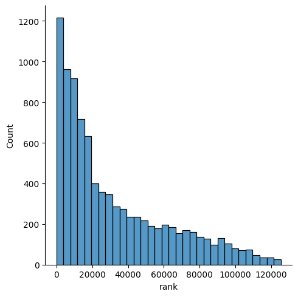
    


```python
sns.displot(ranked_df[ranked_df['funded'] == 0]['rank'])
```


    <seaborn.axisgrid.FacetGrid at 0x23f29a8e508>


    
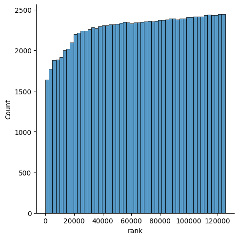
    


### These graphs above show that the ranks for funded leads decrease exponentially, while unfunded leads have a higher count at lower ranks. 

# Question 1
##### How would you measure the business impact of your model?
##### I would measure the impact of the model based on the exploratory data analysis and column weights calculated. Understanding what columns are most important along with which categories in the categorical columns are leading to funded loans. Thus, categories that are leading to unfunded loans can help in ignoring lead with those categories. In addition, the ranking model helps rank a set of leads, thus, we can focus on leads with a higher rank than a lower rank. Based on the data provided, we get a lot of leads in a business day that can be ranked by the end of the day if they are not assigned, and leads over the weekend/holidays can be ranked on the next business day to be assigned to a salesperson.


# Question 2
##### Describe how you would use your model in a business setting.
##### As described in question 1, we can first find the predicted close rates and ranks for all unassigned leads in a day. Based on this, we can select leads to be assigned to salespeople. The remaining unassigned leads can later be ranked to see if they are worth pursuing, however, since there will be an influx of leads everyday, it would be quite impossible to assign these remaining leads. Maybe an intern can pursue them as a part of their training.  In addition, those columns whose weights are 0 and appear in the data, those leads can be ignored right away. Maybe those channels could be closed down because they might be adding up on costs but not giving results. 

# Question 3
##### Plot the predicted close rate as a function of lead age. 


##### I do not believe this close rate is a true indicator because it is averaged from 0 to 100. Since there are more negative labels at a lower lead age than positive, and the ratio of positive leads to negative increases with lead age, the plot is as above. 

# Question 4
##### What problems do you foresee when retraining the model a year from now? 
##### I don't think we can directly retrain the model directly. There can be organisational restructuring such that some marketting channels might be removed, more categories of loans be added (debt_uses). In this case, retraining the last model is not possible. We will need to create a new set of feature vectors and then retrain the model. In case everything remains the same and we just  receive new data and retrain, we have to be very careful of choosing correct hyperparameters otherwise we risk losing the learnt model for the previous data (catastrophic forgetting). In addition, if we use the model and it works as desired in the business setting, we will have more funded loans than unfunded. Thus, the class imbalance would be reduced  in the new data, and the population will be more restricted. Retraining the model over this would definitely introduce bias, where the new model would tend to prefer ranking all leads higher than last model, increasing overall recall but decreasing precision. We would then have to come up with a different ranking model, based on the new predicted close rates.


# Question 5
##### How might you improve upon the greedy method of ranking leads based on predicted close rate? 
##### I am assuming the current greedy model is using just the predicted close rates to rank the leads. I propose first assigning a weight to every parameter based on its impact on the outcome (i.e. Funded). For categorical columns, the weight is assigned based on the ratio of the one-hot-encoded column being positive and funded  to the number of values being funded. This gives us an idea about how impactful was the presence of the column in resulting the lead to be funded. It is then multiplied to the value in that column. So if a column has a higher weight, it means that it was more likely to result in the lead being funded. This will help us assign a score to the lead. Then we sort all leads by the predicted close rate and then the score. This is done so that for similar predicted close rates, we can rank the leads to get which lead is better. 


```python

```
